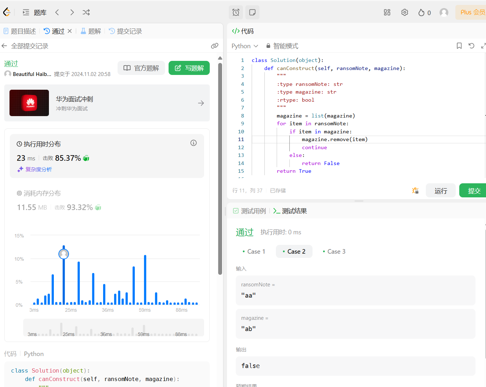
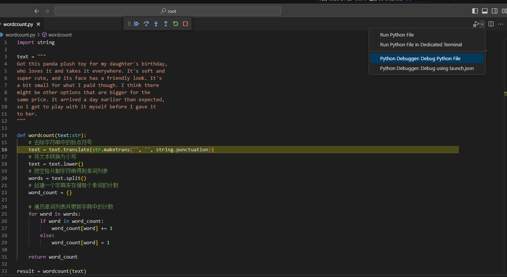

# Python基础
### 闯关任务1 Leetcode 383：
提交截图

源码:

### 闯关任务2 Debug
在Vscode中，可通过在代码文件中加入断点的方式对程序进行调试，如下图所示：  
Python Debug界面:


### 一些补充知识
因为langchain还有一些其他架构中有很多修饰器修饰的函数，第一眼看的时候有点懵，有点怕，所以在此记录。
```python
@a
def b():
    pass
```
a是一个装饰器，它的参数是b   
运行b相当于将b作为参数传入a，并运行a
for example:  
```python
def logit(logfile='out.log'):
    def logging_decorator(func):
        @wraps(func)
        def wrapped_function(*args, **kwargs):
            log_string = func.__name__ + " was called"
            print(log_string)
            # 打开logfile，并写入内容
            return func(*args, **kwargs)
        return wrapped_function
    return logging_decorator
 
@logit()
def myfunc1():
    pass
 
myfunc1()
# Output: myfunc1 was called
```
也可以进一步用类修饰：
```python
from functools import wraps
 
class logit(object):
    def __init__(self, logfile='out.log'):
        self.logfile = logfile
 
    def __call__(self, func):
        @wraps(func)
        def wrapped_function(*args, **kwargs):
            log_string = func.__name__ + " was called"
            print(log_string)
            # 打开logfile并写入
            with open(self.logfile, 'a') as opened_file:
                # 现在将日志打到指定的文件
                opened_file.write(log_string + '\n')
            # 现在，发送一个通知
            self.notify()
            return func(*args, **kwargs)
        return wrapped_function
 
    def notify(self):
        # logit只打日志，不做别的
        pass
```

来源：[菜鸟教程](https://www.runoob.com/w3cnote/python-func-decorators.html)