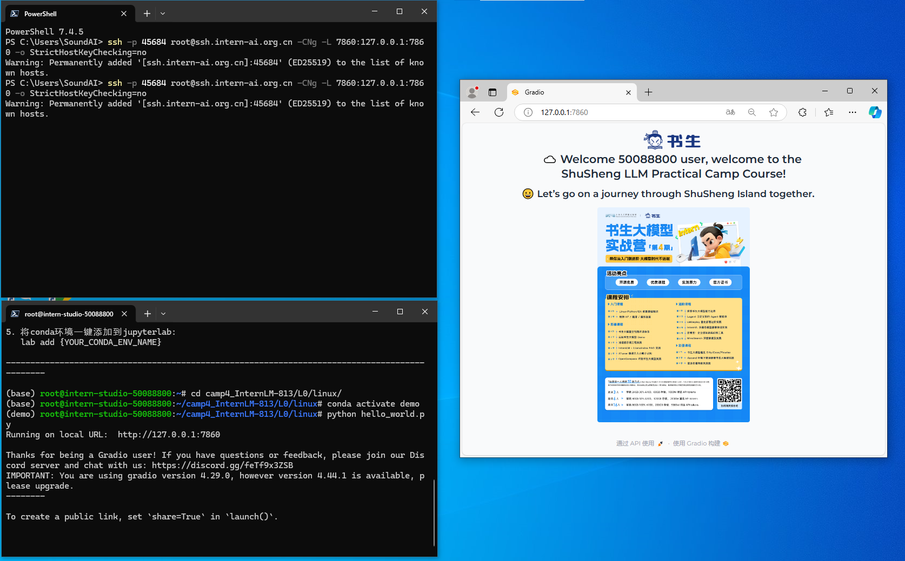

# Linux 闯关
#### 闯关任务 完成SSH连接与端口映射并运行hello_word.py
结果如图所示：

### 一些Linux八股
##### 文件搜索grep  
**grep 过滤** 当搜索用
基本使用方法：
```
grep [OPTIONS] PATTERN [FILE...]
--color=auto 对匹配到的文本着色显示
-v 显示不被pattern匹配到的行
-r 递归搜索目录
-i 忽略字符大小写
-n 显示匹配的行号
-c 统计匹配的行数
-o 仅显示匹配到的字符串
-q 静默模式，不输出任何信息
-A # after, 后#行
-B # before, 前#行
-C # context, 前后各#行
-e 实现多个选项间的逻辑or关系
grep –e ‘cat ’ -e ‘dog’ file
-w 匹配整个单词
-E 使用ERE,相当于egrep
-F 相当于fgrep，不支持正则表达式
```
for example:
```bash
(base) root@intern-studio-50088800:~# grep -r -n hello camp4_InternLM-813/
camp4_InternLM-813/L0/linux/README.md:2:#### 闯关任务 完成SSH连接与端口映射并运行hello_word.py
```

##### 文件管理
**cat**  
1.一次显示整个文件:  
cat filename  
2.从键盘创建一个文件:  
cat > filename  
3.将几个文件合并为一个文件:  
cat file1 file2 > file  
**df**
磁盘查看  
```
-a 全部文件系统列表
-h 以方便阅读的方式显示信息
-i 显示inode信息
-k 区块为1024字节
-l 只显示本地磁盘
-T 列出文件系统类型
```

**ls**
```
ls -a 列出目录所有文件，包含以.开始的隐藏文件
ls -A 列出除.及..的其它文件
ls -r 反序排列
ls -t 以文件修改时间排序
ls -S 以文件大小排序
ls -h 以易读大小显示
ls -l 除了文件名之外，还将文件的权限、所有者、文件大小等信息详细列出来
```